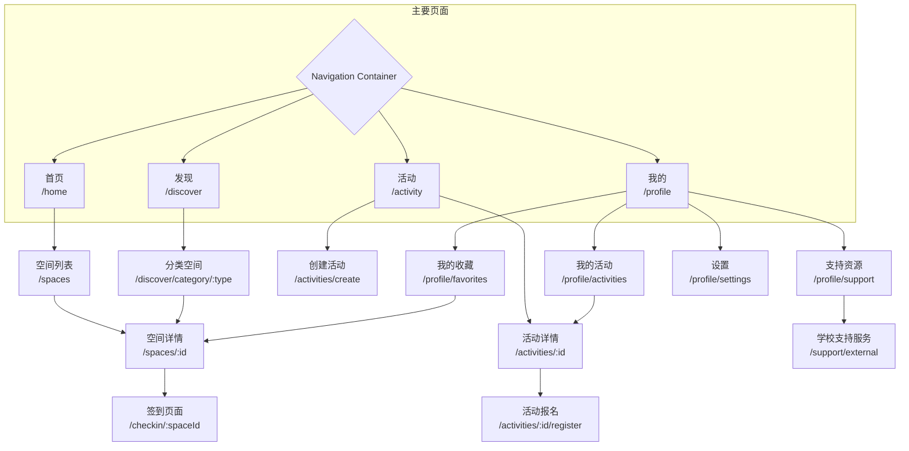

# User Flow — StudySpot 移动端

```mermaid
graph TD
  %% Navigation Container (Max 4 pages)
  NavContainer{Navigation Container}

  %% Core Pages (accessible from main navigation)
  subgraph "主要页面"
    NavContainer --> Home["首页<br/>/home"]
    NavContainer --> Discover["发现<br/>/discover"]
    NavContainer --> Activity["活动<br/>/activity"]
    NavContainer --> Profile["我的<br/>/profile"]
  end

  %% Home Flow - Space Discovery
  Home --> SpaceList["空间列表<br/>/spaces"]
  SpaceList --> SpaceDetail["空间详情<br/>/spaces/:id"]
  SpaceDetail --> CheckIn["签到页面<br/>/checkin/:spaceId"]

  %% Discover Flow - Exploration
  Discover --> CategorySpaces["分类空间<br/>/discover/category/:type"]
  CategorySpaces --> SpaceDetail

  %% Activity Flow - Community Engagement
  Activity --> ActivityDetail["活动详情<br/>/activities/:id"]
  ActivityDetail --> ActivityRegistration["活动报名<br/>/activities/:id/register"]
  Activity --> CreateActivity["创建活动<br/>/activities/create"]

  %% Profile Flow - Personal Management
  Profile --> MyFavorites["我的收藏<br/>/profile/favorites"]
  Profile --> MyActivities["我的活动<br/>/profile/activities"]
  Profile --> SupportResources["支持资源<br/>/profile/support"]
  Profile --> Settings["设置<br/>/profile/settings"]

  %% Cross-page Navigation
  MyFavorites --> SpaceDetail
  MyActivities --> ActivityDetail
  SupportResources --> ExternalSupport["学校支持服务<br/>/support/external"]
```
